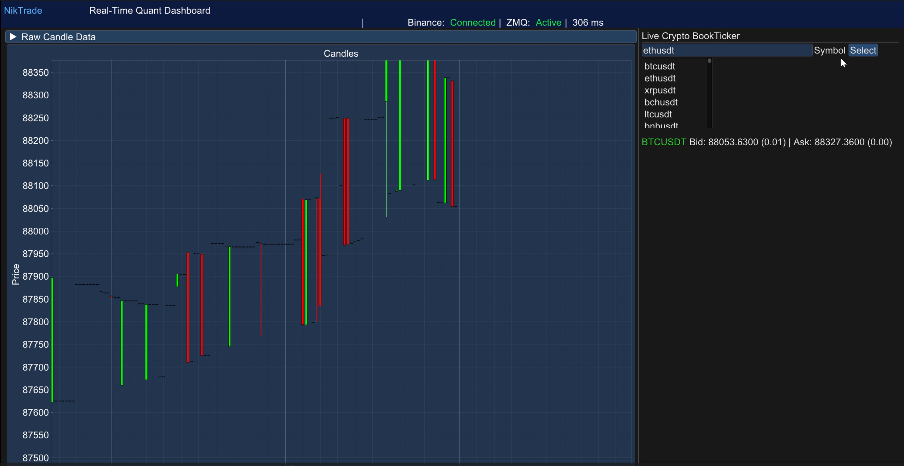

# NikTrade

<b style="font-size: 22px; line-height: 0;">**:construction: In Development**</b>

**A Lightweight, Quantitative, Cross-Platform, Trading Dashboard.**

A minimalist, display-only dashboard for visualizing quantitative analyses of exchange-traded equities using quantitative methods. Designed to present clear, data-driven insights without unnecessary complexity.

> Real-time order book and chart display

## Platforms

- macOS (version 13+)
- Windows